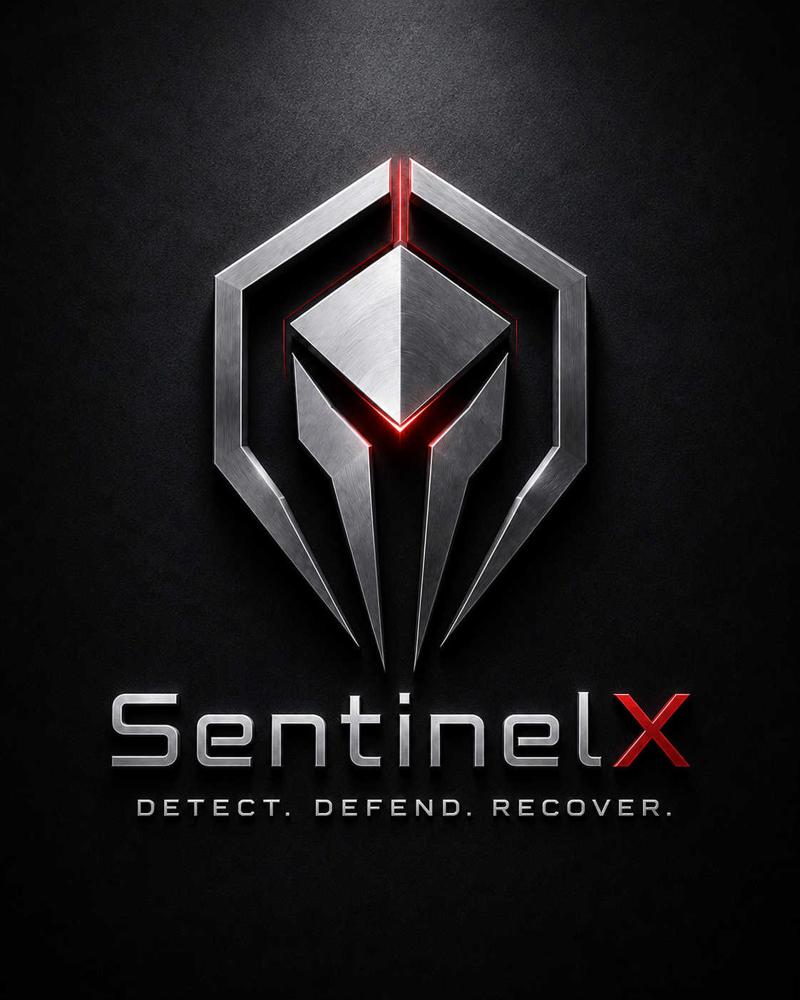

<p align="center">
  
</p>

# SentinelX

**Detect. Defend. Recover.**

**SentinelX** is a distributed monitoring and self‑healing platform for desktop agents, mobile devices, and embedded IoT sensors, built for the COM668 Computing Project. It collects live device health telemetry, detects anomalies, raises alerts, opens incidents, and logs recovery actions — all inside a multi‑tenant operations console.

> **Status: v3.0.0** — the full end‑to‑end pipeline is working, with JWT auth, role‑based access, multi‑tenant isolation, secure device‑token telemetry, embedded sensor support, a native **Android agent** (Kotlin/Compose, v3.0.0 in `agents/android-native/`), and a native **iOS mobile agent** (Swift 6 / SwiftUI, offline‑first) on `feature/ios-mobile-agent`. Branding: teal + slate + sand brown, from the SentinelX mark (`docs/brand/`).

```
Python / Embedded / Android / iOS Agents → FastAPI Backend → PostgreSQL → React Dashboard
```

---

## Architecture

| Path | Component | Description |
|------|-----------|-------------|
| `backend/` | **FastAPI API** | One authoritative API — auth, RBAC, multi‑tenant data, metric ingestion, alerts, incidents, audit & security logs |
| `frontend/` | **React dashboard** | Light "Operations Console" SaaS UI (React 19 + Vite + Tailwind v4) |
| `agents/desktop-python/` | **Desktop agent (v3.0.0)** | Python + psutil agent; device‑token authenticated CPU/memory/disk telemetry |
| `agents/android-native/` | **Android agent (v3.0.0)** | Kotlin/Compose "Sentinel Glass" telemetry agent — batch metrics with preserved timestamps, battery/network extras |
| `agents/ios-native/ios/` | **iOS mobile agent** | Swift 6 / SwiftUI telemetry agent — battery, thermal, storage, network collectors; WebSocket streaming with a durable SQLite offline queue |
| `agents/ios-native/server/` | **Mobile dev server** | FastAPI + SQLite executable contract for the mobile API (`/api/v1/mobile/*`, port 8100) with 49 contract tests |
| `agents/mobile-expo/` | **Expo mobile app (WIP)** | React Native / Expo cross‑platform mobile agent scaffold |
| `agents/embedded-bridge/` | **Embedded bridge** | Python BLE/serial bridge that forwards embedded sensor data to the backend |
| `embedded/arduino_nano33_ble_sense_rev2/` | **Embedded firmware** | Arduino Nano 33 BLE Sense Rev2 sketch — temperature, pressure, motion, impact |
| `migrations/` | **Database migrations** | Versioned SQL files, applied deterministically via `python -m app.db.apply_migrations` (no Alembic) |
| `tests/` | **Test suites** | `backend/` (118 tests), `contract/`/`integration/` (placeholders), `e2e/` (17 staging release scenarios), `load/` (Locust load/soak) |
| `docs/` | **Docs & assets** | Demo accounts (`DEMO_USERS.md`), AI observability architecture, release engineering docs (`releases/`), brand assets (`brand/`) |
| `docker-compose.yml` | **Local Postgres** | Development database service |
| `.github/workflows/` | **CI** | Backend/frontend/desktop-agent/Android pipelines, plus iOS |

---

## Key Features (implemented)

- **Authentication & RBAC** — JWT login/signup; six roles (`platform_admin → owner → admin → engineer → operator → viewer`) with a role hierarchy and per‑endpoint gates.
- **Multi‑tenancy** — every record is organization‑scoped; tenants cannot see each other's data. Platform admins see across tenants.
- **Secure device telemetry** — agents authenticate with hashed **device tokens** (Bearer). Metrics, heartbeats and agent recovery logs are validated against the token's device.
- **Metric pipeline** — agents POST CPU/memory/disk; the backend stores metrics, evaluates configurable **alert rules** (with cooldowns), falls back to threshold **anomaly detection**, and **auto‑creates incidents** for critical alerts.
- **Embedded / IoT** — Arduino Nano 33 BLE Sense firmware + a Python BLE/serial bridge stream temperature, humidity, pressure, motion and impact events as embedded telemetry.
- **Operations surfaces** — devices, metrics explorer, alerts, incidents (with timelines), recovery actions & commands, notifications, reports, device health scoring.
- **Governance** — structured **audit logs** (business events) and separate **security logs** (auth, device‑token and rate‑limit forensics), plus device credentials management and user settings.
- **Rate limiting** — login and telemetry endpoints are rate‑limited (SlowAPI).
- **AI observability & hybrid detection** — a shadow‑mode statistical baseline + IsolationForest score telemetry without ever auto‑creating alerts; a governed model‑lifecycle ladder (`candidate → shadow → advisory → alert_eligible`) gates promotion; a hybrid decision pipeline folds rule‑based alerts and AI evidence into one versioned verdict, with rules always authoritative.
- **Signed recovery commands** — Ed25519‑signed, TTL‑bound recovery commands dispatched to agents and verified client‑side before execution.
- **Release engineering** — versioned releases across all four components, deterministic SQL migrations (`python -m app.db.apply_migrations`), CI for backend/frontend/desktop/Android, a native Windows installer for the desktop agent, and a staging environment for pre‑production rehearsal (see `docs/releases/`).
- **iOS mobile agent (in progress)** — native Swift 6 agent with device registration + JWT refresh (Keychain‑stored), five telemetry collectors, live WebSocket streaming with REST batch fallback, and an offline‑first SQLite queue (events survive airplane mode and app kills; server‑side `event_id` idempotency guarantees no loss, no duplicates). Built and tested entirely on GitHub Actions — no Mac required; sideloaded to a physical iPhone. See `agents/ios-native/ios/Guide01.md`.

---

## Design

The frontend uses the **"Operations Console"** design system — a light, off‑white enterprise palette with soft gradient blending, an indigo accent, frosted panels, and **Plus Jakarta Sans** typography. The public entry route (`/`) is a scroll‑animated cover page; the console itself is fully responsive with a collapsible sidebar. Design tokens live in `frontend/src/styles/sentinelx.css` as `--sx-*` CSS variables.

---

## Technology Stack

| Layer | Technology |
|-------|-----------|
| Frontend | React 19, TypeScript, Vite 8, Tailwind CSS v4, TanStack Query & Table, Recharts, GSAP |
| Backend | Python, FastAPI, SQLAlchemy 2, Pydantic v2, PyJWT, pwdlib (argon2), SlowAPI |
| Database | PostgreSQL (psycopg 3) |
| Desktop agent | Python, psutil, httpx |
| Embedded | Arduino Nano 33 BLE Sense Rev2, Python BLE/serial bridge |
| iOS agent | Swift 6 (strict concurrency), SwiftUI, SQLite, URLSession WebSockets, XcodeGen |
| Tooling | Git & GitHub, Docker Compose, GitHub Actions (iOS CI on macOS runners) |

---

## Getting Started

Each component runs from its own directory with its own environment. Copy the matching `.env.example` to `.env` first.

### 1. Database
```bash
docker compose up -d        # starts PostgreSQL
```

### 2. Backend (FastAPI)
```powershell
cd backend
.\.venv\Scripts\Activate.ps1
python -m app.db.init_db     # create tables (first run)
python -m app.db.seed        # optional: load demo tenants, users, devices & a device token
uvicorn app.main:app --reload
# API on http://127.0.0.1:8000  ·  Swagger at /docs
```

### 3. Desktop agent
```powershell
cd agents\desktop-python
.\.venv\Scripts\Activate.ps1
# paste the "TechNova Laptop Token" printed by seed.py into agents/desktop-python/.env (SENTINELX_DEVICE_TOKEN)
python -m sentinelx_agent
```

### 4. Frontend (React + Vite)
```powershell
cd frontend
npm install
npm run dev                  # http://127.0.0.1:5173
npm run build                # tsc + vite production build
npm run lint                 # eslint
```

### 5. iOS mobile agent (optional — physical iPhone)
```powershell
powershell -File agents\ios-native\scripts\start_device_pass.ps1   # dev server on the LAN
```
The app itself is built by the **iOS Agent** GitHub Actions workflow (unsigned
`.ipa` artifact) and sideloaded from Windows — full walkthrough in
`agents/ios-native/ios/Guide01.md`.

### Demo credentials (after `seed.py`)
All demo users share the password **`SentinelX2026!`**:

| Role | Email |
|------|-------|
| Platform admin | `admin@sentinelx.io` |
| Owner (TechNova) | `sarah.chen@technova.io` |
| Admin (TechNova) | `ops@technova.io` |
| Admin (Apex) | `ops@apexrobotics.io` |

---

## Project Constraints (coursework)

- **No Alembic** — fresh dev schema changes use `init_db` (create tables); `seed.py` resets demo data in dev. Changes to an existing database go through hand‑written SQL in `migrations/`, applied via `python -m app.db.apply_migrations`.
- **Stateless JWT** — no token blacklist; logout is audit‑logged only.
- **Non‑destructive recovery** — the agent records recovery actions as DB evidence only; it never kills processes or reboots the host.

---

## Academic Context

Developed for the **COM668 Computing Project** module using professional software‑engineering practices: version control, layered architecture, documentation, and structured evaluation. Coursework reports and university submission evidence are kept separately from this source repository.
