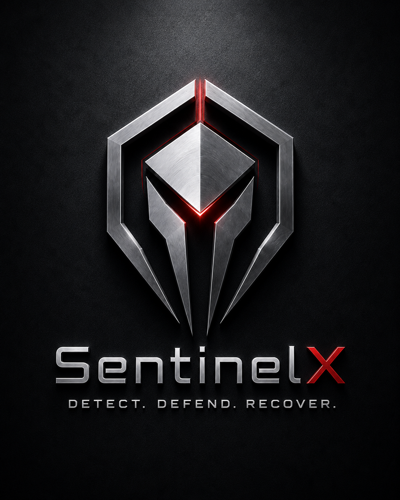

<p align="center">
  
</p>

# SentinelX

**Detect. Defend. Recover.**

**SentinelX** is a distributed monitoring and self‑healing platform for desktop agents, mobile devices, and embedded IoT sensors, built for the COM668 Computing Project. It collects live device health telemetry, detects anomalies, raises alerts, opens incidents, and logs recovery actions — all inside a multi‑tenant operations console.

> **Status: v4.0.0** — the finished local product. Two organisations: **SentinelX Live** (real hardware — the Windows laptop and Android phone, enrolled by QR/one-line pairing, sending genuine telemetry) and **SentinelX Demo** (seeded presentation data). The authenticated home is **Sentinel Command** — a live operational picture with real posture, the Sentinel Core device topology, a NOW stream and a system pulse timeline. Branding: crimson + slate on warm stone neutrals, Geist Sans/Mono (self-hosted).
>
> **Hosting is paused.** SentinelX currently runs locally only — there is no deployed environment and no active cloud dependency. See [`docs/adr/0003-hosting-freeze.md`](docs/adr/0003-hosting-freeze.md).
>
> The **iOS agent** (Swift 6 / SwiftUI, offline‑first) is a *functional prototype, not yet a client of this API* — it talks to its own dev server in `agents/ios-native/server/`. See [iOS status](#ios-agent-status) before relying on it.

```
Python / Embedded / Android / iOS Agents → FastAPI Backend → PostgreSQL → React Dashboard
```

---

## Architecture

| Path | Component | Description |
|------|-----------|-------------|
| `backend/` | **FastAPI API** | One authoritative API — auth, RBAC, multi‑tenant data, metric ingestion, alerts, incidents, audit & security logs |
| `frontend/` | **React dashboard** | Light "Operations Console" SaaS UI (React 19 + Vite + Tailwind v4) |
| `agents/desktop-python/` | **Desktop agent (v3.0.0)** | Python + psutil agent; device‑token authenticated CPU/memory/disk telemetry |
| `agents/android-native/` | **Android agent (v3.0.0)** | Kotlin/Compose "Sentinel Glass" telemetry agent — batch metrics with preserved timestamps, battery/network extras |
| `agents/ios-native/ios/` | **iOS mobile agent** | Swift 6 / SwiftUI telemetry agent — battery, thermal, storage, network collectors; WebSocket streaming with a durable SQLite offline queue |
| `agents/ios-native/server/` | **Mobile dev server** | FastAPI + SQLite executable contract for the mobile API (`/api/v1/mobile/*`, port 8100) with 49 contract tests |
| `agents/embedded-bridge/` | **Embedded bridge** | Python BLE/serial bridge that forwards embedded sensor data to the backend |
| `embedded/arduino_nano33_ble_sense_rev2/` | **Embedded firmware** | Arduino Nano 33 BLE Sense Rev2 sketch — temperature, pressure, motion, impact |
| `migrations/` | **Database migrations** | Versioned SQL files, applied deterministically via `python -m app.db.apply_migrations` (no Alembic) |
| `tests/` | **Test suites** | `backend/` (218), `contract/` (34), `integration/` (10), `e2e/` (17 staging scenarios, needs a live backend), `load/` (Locust) — plus 63 frontend tests under `frontend/src/**` |
| `docs/` | **Docs & assets** | Architecture decision records (`adr/`), demo accounts (`DEMO_USERS.md`), AI observability architecture, release engineering docs (`releases/`), brand assets (`brand/`) |
| `docker-compose.yml` | **Local Postgres** | Development database service |
| `.github/workflows/` | **CI** | Backend (+contract/integration), frontend (lint/test/build), desktop agent, Android, iOS, container build+scan. Nothing is published or uploaded on a normal push — see [`docs/adr/0004-ci-artifact-policy.md`](docs/adr/0004-ci-artifact-policy.md) |

---

## Key Features (implemented)

- **Authentication & sessions** — 15‑minute access tokens held in memory by the dashboard, paired with a rotating HttpOnly refresh cookie and a server‑side session record. Logout, "sign out everywhere" and account deactivation revoke immediately; refresh‑token replay revokes the whole session family. JWTs are validated for issuer, audience, purpose and expiry. See [`docs/adr/0001-browser-session-architecture.md`](docs/adr/0001-browser-session-architecture.md).
- **RBAC** — six roles (`platform_admin → owner → admin → engineer → operator → viewer`) with a role hierarchy and per‑endpoint gates.
- **Multi‑tenancy** — every record is organization‑scoped; tenants cannot see each other's data. Platform admins see across tenants.
- **Secure device telemetry** — agents authenticate with hashed **device tokens** (Bearer). Metrics, heartbeats and agent recovery logs are validated against the token's device.
- **Metric pipeline** — agents POST CPU/memory/disk; the backend stores metrics, evaluates configurable **alert rules** (with cooldowns), falls back to threshold **anomaly detection**, and **auto‑creates incidents** for critical alerts.
- **Embedded / IoT** — Arduino Nano 33 BLE Sense firmware + a Python BLE/serial bridge stream temperature, humidity, pressure, motion and impact events as embedded telemetry.
- **Operations surfaces** — devices, metrics explorer, alerts, incidents (with timelines), recovery actions & commands, notifications, reports, device health scoring.
- **Governance** — structured **audit logs** (business events) and separate **security logs** (auth, device‑token and rate‑limit forensics), plus device credentials management and user settings.
- **Rate limiting** — login and telemetry endpoints are rate‑limited (SlowAPI).
- **AI observability & hybrid detection** — a shadow‑mode statistical baseline + IsolationForest score telemetry without ever auto‑creating alerts; a governed model‑lifecycle ladder (`candidate → shadow → advisory → alert_eligible`) gates promotion; a hybrid decision pipeline folds rule‑based alerts and AI evidence into one versioned verdict, with rules always authoritative.
- **Signed recovery commands** — Ed25519‑signed, TTL‑bound recovery commands dispatched to agents and verified client‑side before execution.
- **Release engineering** — versioned releases across all four components, deterministic SQL migrations (`python -m app.db.apply_migrations`), CI for backend/frontend/desktop/Android, a native Windows installer for the desktop agent, and a staging environment for pre‑production rehearsal (see `docs/releases/`).
- **iOS mobile agent (in progress)** — native Swift 6 agent with device registration + JWT refresh (Keychain‑stored), five telemetry collectors, live WebSocket streaming with REST batch fallback, and an offline‑first SQLite queue (events survive airplane mode and app kills; server‑side `event_id` idempotency guarantees no loss, no duplicates). Built and tested entirely on GitHub Actions — no Mac required; sideloaded to a physical iPhone. See `agents/ios-native/ios/Guide01.md`.

---

## Design

The frontend uses the **"Operations Console"** design system — warm‑stone neutrals with slate support and the SentinelX **crimson** brand accent (sand brown reserved for warnings), set in self‑hosted **Geist Sans** with **Geist Mono** for telemetry and timestamps. The authenticated home, **Sentinel Command**, is a dark near‑black operational surface: real posture headline, the Sentinel Core device topology with live per‑device vitals, an animated signal‑field backdrop (fully disabled under `prefers-reduced-motion`), a NOW activity stream and a system pulse timeline — every value on it is real backend state. The public entry route (`/`) is a scroll‑animated cover page; the console is fully responsive with a collapsible sidebar. Design tokens live in `frontend/src/styles/sentinelx.css` as `--sx-*` CSS variables.

---

## Technology Stack

| Layer | Technology |
|-------|-----------|
| Frontend | React 19, TypeScript, Vite 8, Tailwind CSS v4, TanStack Query & Table, Recharts, GSAP |
| Frontend tests | Vitest 4, React Testing Library, jsdom, axe-core |
| Backend | Python, FastAPI, SQLAlchemy 2, Pydantic v2, PyJWT, pwdlib (argon2), SlowAPI |
| Database | PostgreSQL (psycopg 3) |
| Desktop agent | Python, psutil, httpx |
| Embedded | Arduino Nano 33 BLE Sense Rev2, Python BLE/serial bridge |
| iOS agent | Swift 6 (strict concurrency), SwiftUI, SQLite, URLSession WebSockets, XcodeGen |
| Tooling | Git & GitHub, Docker Compose, GitHub Actions (standard runners only, incl. free macOS runners for iOS CI) |

---

## Getting Started

Each component runs from its own directory with its own environment. Copy the matching `.env.example` to `.env` first.

### 1. Database
```bash
docker compose up -d        # starts PostgreSQL
```

### 2. Backend (FastAPI)
```powershell
cd backend
.\.venv\Scripts\Activate.ps1
python -m app.db.init_db     # create tables (first run)
python -m app.db.seed        # optional: load demo tenants, users, devices & a device token
uvicorn app.main:app --reload
# API on http://127.0.0.1:8000  ·  Swagger at /docs
```

### 3. Windows agent (paired — recommended)
In the console: **Devices → Add Device → Windows**, then run the setup command it shows on the target machine:
```powershell
cd agents\desktop-python
powershell -ExecutionPolicy Bypass -File setup_windows_agent.ps1 -BackendUrl http://<host>:8000 -PairingCode sxe_...
```
The script creates the virtualenv, enrols the machine with the one-time code (token → Windows Credential Manager), delivers first telemetry, and — from an elevated shell — installs the auto-starting `SentinelXAgent` service. Manual start remains `python -m sentinelx_agent`.

### 3b. Android agent (paired)
Install `agents/android-native/dist/SentinelX-Android-Agent-v4.0.0.apk`, open the app, tap **Connect to SentinelX** and scan the QR from **Devices → Add Device → Android**. A fallback pairing code covers devices without a camera/Play services.

### 4. Frontend (React + Vite)
```powershell
cd frontend
npm install
npm run dev                  # http://127.0.0.1:5173
npm run build                # tsc + vite production build
npm run lint                 # eslint
```

### 5. iOS mobile agent (optional — physical iPhone)
```powershell
powershell -File agents\ios-native\scripts\start_device_pass.ps1   # dev server on the LAN
```
The app itself is built by the **iOS Agent** GitHub Actions workflow (unsigned
`.ipa` artifact) and sideloaded from Windows — full walkthrough in
`agents/ios-native/ios/Guide01.md`.

### 6. Tests
```powershell
# Backend + contract + integration (needs local Postgres)
cd backend
.\.venv\Scripts\Activate.ps1
$env:PYTHONPATH="."; pytest ../tests/backend ../tests/contract ../tests/integration

# Frontend unit/component/accessibility
cd frontend
npm test
```

### Seeded credentials (after `seed.py`)
All seeded users share the password **`SentinelX2026!`** — full list in `docs/DEMO_USERS.md`:

| Role | Email | Organisation |
|------|-------|-------------|
| Platform admin | `admin@sentinelx.io` | Platform |
| Owner | `abdulrehmanv2004@gmail.com` | SentinelX Live (real devices) |
| Admin | `ops@sentinelx.live` | SentinelX Live (real devices) |
| Admin | `ops@demo.sentinelx.io` | SentinelX Demo (seeded data) |

---

## iOS agent status

The iOS work in `agents/ios-native/` is substantial (85 Swift files, 17 test files) and
actively maintained, but it is **not yet a client of the SentinelX production API**:

- It targets its own FastAPI + SQLite dev server (`agents/ios-native/server/`, port 8100).
- Its six endpoints (`register`, `login`, `token/refresh`, `profile`, `batch`, `config`)
  do not intersect the `/api/v1` contract, which uses `/auth/login`, `/devices/enroll`,
  `/metrics/batch`, `/heartbeats` and `/agent/commands/next`.
- It expects a refresh‑token flow — the backend now has one (`POST /api/v1/auth/refresh`), but the iOS client's endpoint shapes still differ.
- Device‑token enrolment and Ed25519 recovery‑command verification are **not implemented**.

Reaching parity means rewriting its networking layer against `/api/v1`. That is tracked as a
separate milestone after the first production deployment — see
`docs/PRODUCTION_READINESS_AUDIT.md` §D. Do not describe iOS as a working SentinelX client
until that work lands.

---

## Project Constraints (coursework)

- **No Alembic** — fresh dev schema changes use `init_db` (create tables); `seed.py` resets demo data in dev. Changes to an existing database go through hand‑written SQL in `migrations/`, applied via `python -m app.db.apply_migrations`.
- **Revocable sessions** — access tokens are bound to a server‑side `user_sessions` row, so logout and revocation take effect on the next request rather than at token expiry.
- **Allowlisted recovery** — agents execute a fixed set of typed, signed, non‑destructive actions (log rotation, queue/DB repair, service restart, monitoring‑mode toggles). Never arbitrary shell, process termination, or reboot.
- **Hosting paused** — no cloud resources; local development only.

---

## Licence

Licensed under the Apache License 2.0. See [`LICENSE`](LICENSE) for the full text.

---

## Academic Context

Developed for the **COM668 Computing Project** module using professional software‑engineering practices: version control, layered architecture, documentation, and structured evaluation. Coursework reports and university submission evidence are kept separately from this source repository.
