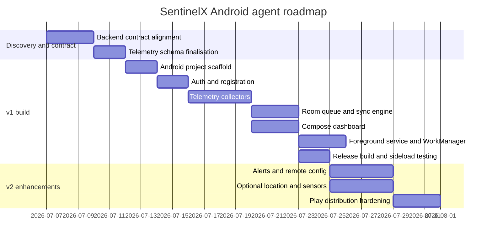
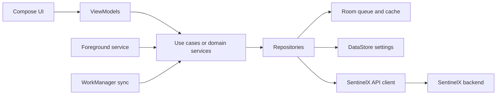
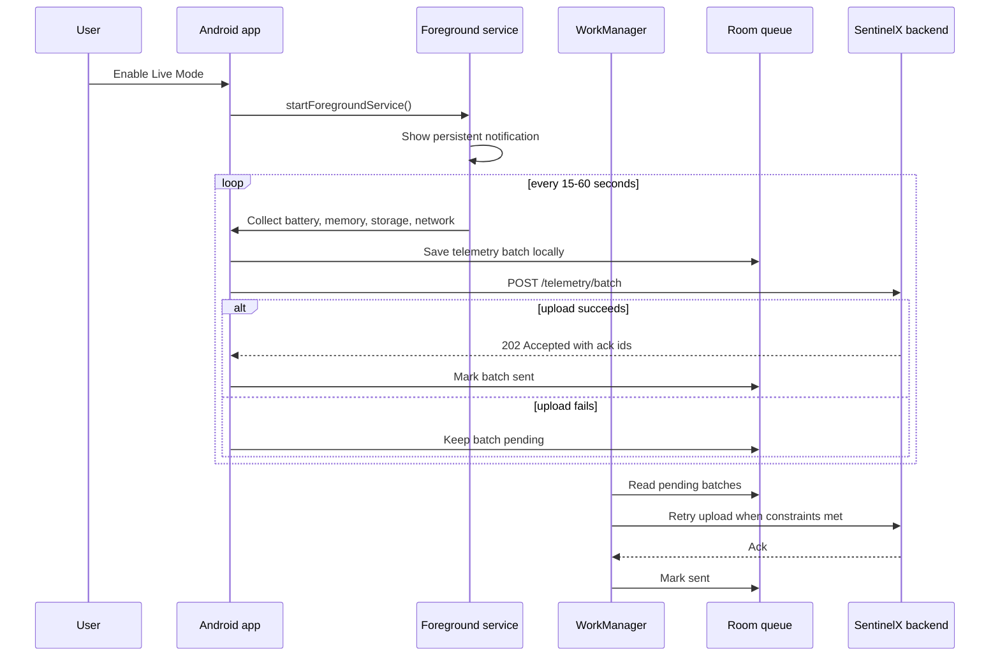
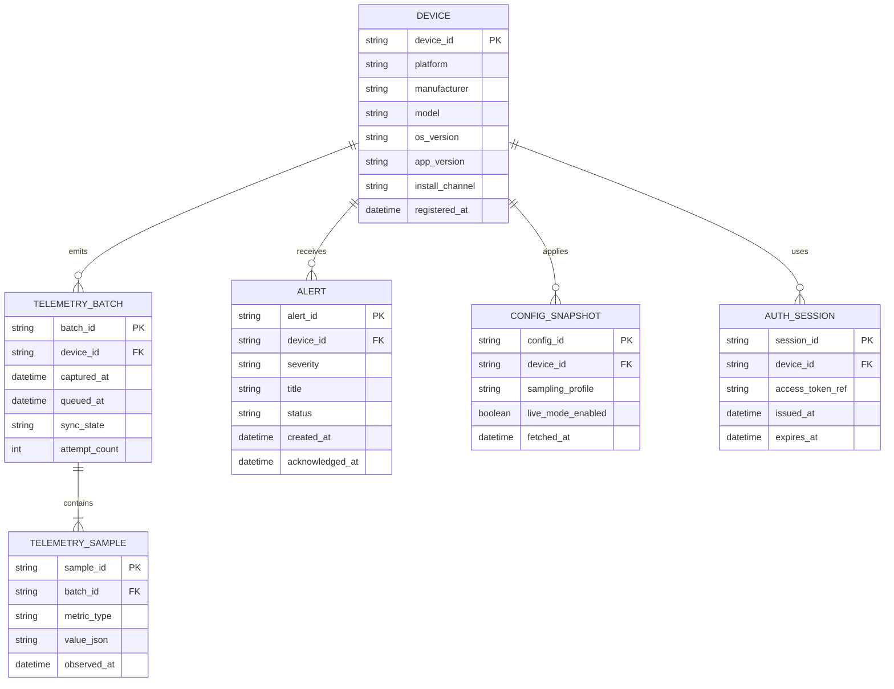

# Production Android Agent for SentinelX on Pixel 4 XL

## Executive summary

The best path is to build the Android app as an **internally distributed, production-style agent APK first**, and treat Google Play as a later distribution channel rather than the starting point. That recommendation follows directly from the platform constraints: truly “live” background work on Android must be user-visible through a foreground service with a notification, while durable scheduled work belongs in WorkManager, which persists across app restarts and device reboots but is designed for deferrable work and enforces a minimum periodic interval of 15 minutes. On Android 14 and above, foreground service types and matching permissions are mandatory, and on Android 15+ the `dataSync` foreground service type is time-limited to six hours in a 24-hour period. In other words, a hidden always-on mobile agent is not aligned with current Android rules, but a **hybrid model** is. citeturn0search0turn0search4turn15search0turn19search1turn19search9

For SentinelX, the strongest architecture is a **hybrid agent** with two modes. **Live Mode** uses a foreground service only when the user explicitly enables continuous monitoring or opens the in-app dashboard. **Reliable Sync Mode** uses WorkManager for periodic catch-up, buffering, retries, and post-reboot continuity. That lets the app feel production-grade without fighting the OS. It also lines up with Android’s recommended app architecture: a layered design, unidirectional data flow, ViewModels in the UI layer, repositories in the data layer, dependency injection, coroutine-based execution, and local persistence for offline handling. citeturn0search2turn0search11turn0search17turn0search20turn5search10turn7search1turn7search0

For the **v1 MVP**, the app should focus on: agent registration, authentication, battery/memory/storage/network telemetry, a local cache, a Compose dashboard, a foreground service notification, and a periodic sync worker. **Do not** put “running apps” or broad package visibility into v1 unless it is absolutely required, because Android 11+ filters package visibility by default and usage statistics require special access through system settings. Optional location and richer sensor packs should also wait unless SentinelX has a clear product reason for them. citeturn8search0turn8search20turn4search4turn18search2turn18search3

The **Google Pixel 4 XL** is still technically suitable for this role: it has a 6.3-inch QHD+ OLED display, 6 GB LPDDR4x RAM, Snapdragon 855, 64/128 GB storage, a 3700 mAh battery, and sensors including accelerometer, gyrometer, magnetometer and barometer. However, Google states that Pixel 4 and Pixel 4 XL **no longer receive Android version updates or security updates**, which materially increases operational risk for any sensitive production deployment. That makes the device a good engineering and portfolio target, but a weaker choice for high-sensitivity credentials or unattended field deployment. citeturn14view0turn3search0

The practical recommendation is therefore:

| Decision area | Recommended default | Why |
|---|---|---|
| Initial distribution | Signed APK, sideloaded internally | Fastest route to a working agent; avoids Play onboarding friction while the API and telemetry schema are still changing. citeturn17view0turn20view0 |
| Background model | Foreground service for Live Mode, WorkManager for periodic sync | Matches Android’s current execution model and battery guidance. citeturn0search0turn0search4turn15search0turn4search3 |
| UI stack | Kotlin + Jetpack Compose + Material 3 | Aligns with modern Android guidance and scales well for a dashboard-style app. citeturn5search7turn5search3turn0search2 |
| Local persistence | Room for telemetry queue, DataStore for settings and lightweight state | Room is appropriate for structured cached data; DataStore is the modern replacement for many SharedPreferences-like cases. citeturn7search1turn7search0turn10search18 |
| DI and architecture | Hilt + layered repository architecture | Jetpack recommends Hilt for DI and a layered architecture for maintainability and testing. citeturn5search10turn0search11 |
| Play Store later | AAB + Play App Signing + internal testing first | Google Play requires modern target API levels and strongly favours the bundle/signing pipeline. citeturn17view0turn2search4turn9search0turn9search12 |

## Product definition and roadmap

### Assumptions used in this report

Because the prompt says the SentinelX backend already exists but does not specify its current endpoints, authentication model, schema, or transport guarantees, the API contract and sequence flows below are **proposed assumptions** that should be reconciled against the real backend before implementation. I assume SentinelX already supports HTTPS, can accept device registration and telemetry ingestion, and can return dashboard summaries and alerts. Where details are unknown, I explicitly mark the design as a recommendation rather than a claim.

### Product requirements

The Android agent should be framed as two things at once: an **edge collector** and a **mobile operations console**. The collector samples device state and sends telemetry to SentinelX. The console gives the user immediate visibility into health, last sync, connection state, and alerts. In production terms, the app is not just “a phone app”; it is a **managed telemetry endpoint** with observability, retry behaviour, and secure distribution. That framing is what makes it portfolio-grade rather than a student demo. The choice is also consistent with Android’s emphasis on robust architecture, testability, and maintainability as apps grow. citeturn0search2turn0search5turn0search11

A concise PRD for v1 is below.

| Area | Requirement |
|---|---|
| Product goal | Turn a Pixel 4 XL into a SentinelX-managed Android node that can register, authenticate, stream or batch telemetry, and show device health in-app |
| Primary users | You as operator/developer; later, an internal tester or demo operator |
| Success criteria | Device registers successfully; telemetry reaches backend reliably; dashboard shows latest state; retries work offline/online; app survives process death/reboot through WorkManager; release APK installs cleanly on Pixel |
| Must-have telemetry | Battery, charge state, memory, storage, network reachability/type, app/device metadata, last successful sync |
| Nice-to-have later | Location, sensor streams, alert push, remote config, command execution, richer diagnostics |
| Non-functional requirements | Secure transport, offline caching, idempotent ingestion, predictable battery usage, release signing, observability, test coverage |

### User stories

These user stories are the ones worth implementing first because they map cleanly onto Android’s execution and permission model.

| Role | User story | Priority |
|---|---|---|
| Operator | As an operator, I want to register the phone as a SentinelX device so the backend recognises it as a distinct agent | P0 |
| Operator | As an operator, I want to see current battery, memory, storage and network state in-app so I can confirm the device is healthy | P0 |
| Operator | As an operator, I want the app to upload telemetry even after network interruptions so that monitoring remains reliable | P0 |
| Operator | As an operator, I want a clear “Live Mode” switch so I can explicitly enable continuous monitoring and understand why a foreground notification appears | P0 |
| Operator | As an operator, I want the app to keep a local queue when offline and flush it later so data is not lost | P0 |
| Operator | As an operator, I want to see last sync time and backend status in the dashboard so I can diagnose failures quickly | P0 |
| Operator | As an operator, I want to acknowledge alerts from the phone so I can manage incidents away from the laptop | P1 |
| Operator | As an operator, I want optional location and sensor telemetry only when explicitly enabled | P1 |
| Maintainer | As a maintainer, I want signed builds, CI validation and versioning so releases are reproducible | P0 |
| Maintainer | As a future publisher, I want the codebase to be ready for Play later, including target API compliance and app-signing hygiene | P1 |

### MVP scope and roadmap

The MVP should be deliberately narrow because Android background execution gets complicated fast. WorkManager is ideal for durable periodic work but not for second-level live telemetry, while foreground services are visible and constrained. So the right v1 is a disciplined “small production system”, not an all-features agent. citeturn15search0turn0search0turn19search11

**Recommended v1 scope**

| In scope for v1 | Why it belongs in v1 |
|---|---|
| Device registration and token-based auth | Foundational for all later flows |
| Live dashboard in Compose | Makes the app demonstrable and useful |
| Battery, memory, storage, basic network telemetry | Low permission burden, high value |
| Local Room queue for unsent telemetry | Required for production-style reliability |
| WorkManager periodic sync | Durable catch-up and retry path |
| Foreground service Live Mode | Only when user explicitly wants continuous updates |
| Release-signed APK output | Needed for actual device deployment |

**Recommended v2 scope**

| In scope for v2 | Why it waits |
|---|---|
| Alerts push or persistent stream | Higher backend and lifecycle complexity |
| Remote config and feature flags | Valuable after the core pipeline is stable |
| Optional location and richer sensors | Added permissions and privacy surface |
| Device commands | Higher security and abuse risk |
| Play Internal Testing / Internal App Sharing | Best introduced once release discipline exists |
| Play Integrity integration | Relevant only once you distribute through Google Play |

**Should not be in v1 unless there is a hard requirement**

| De-scope item | Why to avoid at first |
|---|---|
| Broad “running apps” inventory | Android 11+ package visibility is restricted by default; usage access is special-access friction and privacy-heavy. citeturn8search0turn4search4turn18search2 |
| Continuous raw sensor streaming in the background | Android 9+ limits background sensor access, and high-frequency sampling is battery-expensive. citeturn7search19turn4search3 |
| Root-only or OEM-private metrics | Not portable, not Play-friendly, not production-standard |
| Exact alarm scheduling | Android recommends exact alarms only for user-facing time-critical cases, not generic telemetry. citeturn3search1turn3search23 |



## Technical architecture and data contract

### Architecture

Android’s current guidance is to separate the app into at least a **UI layer** and a **data layer**, optionally with a **domain layer**, use unidirectional data flow, and keep business logic away from composables. For this app, that maps cleanly to: Compose screens and ViewModels in the UI layer; repositories, sync orchestration, and API clients in the data/domain layers; Room and DataStore locally; and Retrofit or Ktor over HTTPS to SentinelX. Hilt is the most natural DI choice because Jetpack recommends it for Android dependency injection. citeturn0search11turn0search17turn0search20turn5search10turn7search1turn7search0

A strong module layout for a single-app repo is:

```text
:app
:core:model
:core:network
:core:database
:core:datastore
:core:designsystem
:feature:dashboard
:feature:settings
:feature:alerts
:sync
```

This is not mandatory, but Android’s modularisation guidance supports multi-module projects for scalability, clearer ownership, and easier testing. For a one-developer project, even a lighter two- or three-module variant is enough so long as the boundaries stay clean. citeturn0search14turn0search11



### Background execution model

The background model should be **hybrid by design**.

A **foreground service** is appropriate only when the work is noticeable to the user and accompanied by a visible notification. That makes it suitable for a clearly labelled **Live Mode** in which the user wants near-real-time updates and understands that the app is actively monitoring. Starting with Android 14, the service must declare an appropriate foreground service type and matching foreground-service permission; starting with Android 15, `dataSync` foreground services also face six-hour limits in a 24-hour window on devices running Android 15+. citeturn0search0turn0search9turn19search1turn19search2turn19search9

A **WorkManager** worker is appropriate for periodic uploads, retries, catch-up, and post-reboot continuity. Android explicitly recommends WorkManager for work that should continue even if the app leaves the visible state, and its periodic work has a minimum interval of 15 minutes. That means WorkManager is the right backbone for reliability, but not for second-by-second “live telemetry”. WorkManager also supports unique periodic work, which is important for avoiding duplicate schedules. citeturn0search4turn0search16turn15search0turn0search13

A practical policy is:

- **Foreground service:** only when Live Mode is enabled by the user or an incident workflow explicitly calls for active monitoring.
- **WorkManager:** every 15–30 minutes for periodic sync, plus one-time expedited work after important local events such as successful login or network restoration.
- **No boot-time foreground service auto-start:** especially if you later target Android 15 for Play, because certain foreground-service launches from `BOOT_COMPLETED` are restricted. citeturn15search6turn15search7turn19search3



### Pixel telemetry collection strategy

The collection surface should favour APIs that are stable, low-friction, and permission-light.

- **Battery and charging**: `BatteryManager` and the battery sticky intent are appropriate for charge percentage, charging state, plug type, and related health signals. citeturn22search2turn4search1
- **Memory**: device memory pressure belongs to `ActivityManager.getMemoryInfo`, while app-process memory can use `Debug.MemoryInfo` if you want app-specific diagnostics later. citeturn12search5turn22search4turn12search9
- **Storage**: overall filesystem totals and free space are straightforward with `StatFs`; `StorageStatsManager` is more suitable when you need app- or UID-specific storage details. citeturn22search0turn22search3turn22search16
- **Network state**: `ConnectivityManager` and `NetworkCapabilities` should drive connectivity state, while `TrafficStats` can provide byte counters but may return `UNSUPPORTED` on some devices or platforms. citeturn12search3turn12search11turn12search15turn12search6
- **Sensors**: use `SensorManager` only for optional features and sample conservatively. Android documents broad sensor support, but Android 9 introduced limits on background access to certain sensors, so high-frequency passive background capture should not be your default. citeturn7search2turn7search19

### Proposed data model

The schema below is a recommended contract for the Android side. It is intentionally simple: immutable sample records, idempotent upload keys, and a local pending queue.



A recommended telemetry schema for v1 is:

| Metric group | Key fields | Source on device | Notes |
|---|---|---|---|
| `device.identity` | `device_id`, `model`, `manufacturer`, `os_version`, `app_version`, `install_channel` | Build/device metadata | Supports fleet inventory and debugging |
| `battery.status` | `level_pct`, `is_charging`, `plug_type`, `health`, `temperature_c` | `BatteryManager`; temperature best-effort | Keep temperature optional |
| `memory.device` | `avail_mem_bytes`, `total_mem_bytes`, `low_memory`, `threshold_bytes` | `ActivityManager.MemoryInfo` | Good high-value system measure citeturn12search5turn12search9 |
| `storage.device` | `available_bytes`, `free_bytes`, `total_bytes` | `StatFs` | Device-level, no special permission needed for the basics citeturn22search0turn22search3 |
| `network.state` | `is_connected`, `transport`, `is_metered`, `wifi_or_cellular` | `ConnectivityManager`, `NetworkCapabilities` | Prefer state and transport over aggressive probing citeturn12search3turn12search11turn12search15 |
| `network.traffic` | `tx_bytes_total`, `rx_bytes_total` | `TrafficStats` | Treat as optional because support can vary citeturn12search6 |
| `agent.sync` | `last_sync_at`, `queue_depth`, `last_http_status`, `retry_count` | App internal state | Critical for operator trust |

### Proposed API contract

Because the real SentinelX backend contract is unspecified, this API is a **recommended contract** designed for resilient mobile ingestion. It assumes HTTPS and bearer authentication, with the option to evolve to mTLS later for hardened internal deployments.

| Endpoint | Method | Purpose | Auth | Idempotency |
|---|---|---|---|---|
| `/api/v1/agents/register` | `POST` | Register device and receive device identity | bootstrap token or invite code | `device_fingerprint` |
| `/api/v1/auth/token` | `POST` | Exchange device credentials for access token | device secret / refresh | n/a |
| `/api/v1/telemetry/batch` | `POST` | Upload one batch of telemetry samples | bearer token | `batch_id` |
| `/api/v1/agents/heartbeat` | `POST` | Lightweight heartbeat for liveness | bearer token | timestamp bucket |
| `/api/v1/dashboard/summary` | `GET` | Fetch backend-computed dashboard summary | bearer token | n/a |
| `/api/v1/alerts` | `GET` | Fetch outstanding alerts | bearer token | n/a |
| `/api/v1/alerts/{id}/ack` | `POST` | Acknowledge alert | bearer token | alert id |
| `/api/v1/config` | `GET` | Pull config profile, intervals, flags | bearer token | config version |
| `/api/v1/stream` | `WS` | Optional live alerts/status stream | bearer token | connection session |

**Registration request**

```json
{
  "platform": "android",
  "manufacturer": "Google",
  "model": "Pixel 4 XL",
  "os_version": "13",
  "app_version": "1.0.0",
  "install_channel": "sideload",
  "capabilities": [
    "battery",
    "memory",
    "storage",
    "network",
    "foreground_live_mode",
    "workmanager_sync"
  ]
}
```

**Telemetry batch request**

```json
{
  "batch_id": "01K0S4EJ8T7J6P8Q9RC1Q5M6QP",
  "device_id": "px4xl-abdul-001",
  "captured_at": "2026-07-06T10:15:22Z",
  "samples": [
    {
      "metric_type": "battery.status",
      "observed_at": "2026-07-06T10:15:20Z",
      "value": {
        "level_pct": 71,
        "is_charging": false,
        "plug_type": "none"
      }
    },
    {
      "metric_type": "memory.device",
      "observed_at": "2026-07-06T10:15:20Z",
      "value": {
        "avail_mem_bytes": 1654321152,
        "total_mem_bytes": 5933828096,
        "low_memory": false
      }
    },
    {
      "metric_type": "network.state",
      "observed_at": "2026-07-06T10:15:20Z",
      "value": {
        "is_connected": true,
        "transport": "wifi",
        "is_metered": false
      }
    }
  ]
}
```

**Telemetry response**

```json
{
  "accepted": true,
  "batch_id": "01K0S4EJ8T7J6P8Q9RC1Q5M6QP",
  "ingested_count": 3,
  "server_received_at": "2026-07-06T10:15:23Z"
}
```

**Dashboard summary response**

```json
{
  "device_id": "px4xl-abdul-001",
  "status": "healthy",
  "last_seen_at": "2026-07-06T10:15:23Z",
  "last_sync_at": "2026-07-06T10:15:23Z",
  "queue_depth": 0,
  "latest": {
    "battery_pct": 71,
    "available_storage_gb": 42.8,
    "available_memory_mb": 1578,
    "network_transport": "wifi"
  },
  "alerts_open": 1
}
```

### Sample Kotlin snippets

The snippets below are illustrative and follow the architecture recommended by Android’s guidance: the UI should observe state, business logic belongs outside composables, and background work should use the correct platform primitive for the job. citeturn0search11turn0search17turn0search4turn0search0

**Foreground service for Live Mode**

```kotlin
@AndroidEntryPoint
class LiveTelemetryService : LifecycleService() {

    @Inject lateinit var telemetryRepository: TelemetryRepository

    override fun onCreate() {
        super.onCreate()
        val notification = NotificationCompat.Builder(this, CHANNEL_ID)
            .setContentTitle("SentinelX Live Mode")
            .setContentText("Collecting live telemetry")
            .setSmallIcon(R.drawable.ic_stat_agent)
            .setOngoing(true)
            .build()

        ServiceCompat.startForeground(
            this,
            NOTIFICATION_ID,
            notification,
            ServiceInfo.FOREGROUND_SERVICE_TYPE_DATA_SYNC
        )

        lifecycleScope.launch {
            while (isActive) {
                telemetryRepository.collectAndUploadOnce()
                delay(30_000) // keep configurable
            }
        }
    }

    companion object {
        const val CHANNEL_ID = "sentinelx_live"
        const val NOTIFICATION_ID = 1001
    }
}
```

**Unique periodic sync with WorkManager**

```kotlin
class TelemetrySyncScheduler @Inject constructor(
    @ApplicationContext private val context: Context
) {
    fun schedulePeriodicSync() {
        val constraints = Constraints.Builder()
            .setRequiredNetworkType(NetworkType.CONNECTED)
            .build()

        val request = PeriodicWorkRequestBuilder<TelemetrySyncWorker>(
            repeatInterval = 15,
            repeatIntervalTimeUnit = TimeUnit.MINUTES
        )
            .setConstraints(constraints)
            .addTag("telemetry-periodic-sync")
            .build()

        WorkManager.getInstance(context).enqueueUniquePeriodicWork(
            "sentinelx_periodic_sync",
            ExistingPeriodicWorkPolicy.UPDATE,
            request
        )
    }
}
```

**API DTO and Retrofit contract**

```kotlin
@Serializable
data class TelemetryBatchDto(
    val batchId: String,
    val deviceId: String,
    val capturedAt: String,
    val samples: List<TelemetrySampleDto>
)

@Serializable
data class TelemetrySampleDto(
    val metricType: String,
    val observedAt: String,
    val value: JsonObject
)

interface SentinelXApi {
    @POST("/api/v1/telemetry/batch")
    suspend fun uploadTelemetry(
        @Body body: TelemetryBatchDto
    ): Response<UploadTelemetryResponseDto>

    @GET("/api/v1/dashboard/summary")
    suspend fun getDashboardSummary(
        @Query("device_id") deviceId: String
    ): DashboardSummaryDto
}
```

**Compose dashboard card**

```kotlin
@Composable
fun DeviceHealthCard(state: DashboardUiState) {
    Card(
        modifier = Modifier.fillMaxWidth()
    ) {
        Column(modifier = Modifier.padding(16.dp)) {
            Text(text = "Pixel 4 XL", style = MaterialTheme.typography.titleMedium)
            Spacer(Modifier.height(8.dp))
            Text("Status: ${state.status}")
            Text("Battery: ${state.batteryPct}%")
            Text("Memory free: ${state.availableMemoryMb} MB")
            Text("Storage free: ${state.availableStorageGb} GB")
            Text("Network: ${state.networkTransport}")
            Text("Last sync: ${state.lastSyncAt}")
        }
    }
}
```

## Delivery, build, and deployment

### Code standards and project structure

Use **Kotlin**, **Jetpack Compose**, **Material 3**, **Hilt**, **Room**, **DataStore**, coroutines and Flow. That stack is aligned with modern Android practices, and it keeps the app testable and maintainable. Material 3 is the current Compose design system, DataStore is the modern asynchronous and transactional replacement for many SharedPreferences-style cases, Room remains the right abstraction for structured offline data, and Hilt is Jetpack’s recommended DI library. citeturn5search7turn5search3turn7search0turn7search1turn5search10

Use these code conventions:

| Standard | Recommendation |
|---|---|
| Language and UI | Kotlin, Compose, Material 3 |
| Concurrency | Coroutines and Flow |
| Architecture | UI layer → ViewModel → use case/domain → repository → local/remote data sources |
| DI | Hilt |
| Local storage | Room for queue/cache, DataStore for small preferences and flags |
| Naming | Feature-first packages; DTO/Entity/UI model separation |
| Error handling | Network/domain/UI result wrappers; structured logging around sync boundaries |
| Build config | `build.gradle.kts`, version catalog in `libs.versions.toml` |
| Static quality | ktlint or detekt, Android Lint, dependency updates review |

A pragmatic package structure inside `:app` or across modules would look like this:

```text
com.sentinelx.agent
  ├─ core
  │   ├─ network
  │   ├─ database
  │   ├─ datastore
  │   ├─ model
  │   └─ util
  ├─ feature
  │   ├─ dashboard
  │   ├─ settings
  │   └─ alerts
  ├─ service
  ├─ worker
  └─ di
```

### Build, signing, versioning and CI/CD

Android’s release process is explicit: you should version the app with a user-facing `versionName` and a monotonically increasing integer `versionCode`; the system uses `versionCode` to prevent downgrades, and Google Play also requires increasing version codes across releases. Android Studio can generate signed APKs or bundles, and for Play distribution Google recommends Play App Signing with a separate upload key. The signing docs also explicitly warn against keeping signing secrets in plain text in build files. citeturn16view0turn17view0

A recommended release strategy is:

| Build concept | Recommendation | Rationale |
|---|---|---|
| `minSdk` | 29 or 30 | Keeps the app modern while still covering the Pixel 4 XL’s plausible OS range |
| `targetSdk` | 35 | Required for new Play submissions; good future-proofing even for internal builds. citeturn7search7turn9search12 |
| `compileSdk` | latest stable supported in project | Keep aligned with target behaviour and tooling |
| Versioning | `versionName` as SemVer-like string, `versionCode` monotonically increasing | Matches Android’s version model. citeturn16view0 |
| Release artifact now | Signed APK | Best for direct installation and internal testing |
| Release artifact later | AAB | Best for Play distribution and Play App Signing. citeturn17view0turn2search4 |

A disciplined CI/CD pipeline can stay lightweight:

```text
Git push
  -> GitHub Actions
  -> ./gradlew lint test
  -> ./gradlew connectedCheck on emulator matrix
  -> ./gradlew assembleDebug
  -> ./gradlew assembleRelease
  -> sign release with CI secrets
  -> upload APK artifact
  -> optionally distribute to Firebase App Distribution
```

GitHub Actions is well suited here because it supports reusable workflows, encrypted secrets, and downloadable build artefacts. For dependency hygiene and readability, a Gradle version catalog keeps versions centralised in `libs.versions.toml`. citeturn6search5turn6search1turn6search13turn6search17turn6search2turn6search18

A good practical pipeline is:

| Stage | Command or action | Output |
|---|---|---|
| Static checks | `./gradlew lint test` | Fast correctness gate |
| UI/instrumentation | `./gradlew connectedCheck` | Emulator/device validation |
| Performance | Baseline Profile generation and benchmark | Faster startup and smoother first run; Baseline Profiles often improve first-launch execution markedly. citeturn5search1turn5search5turn5search9 |
| Packaging | `./gradlew assembleRelease` | Release APK |
| Signing | CI-injected keystore + passwords from secrets | Signed release |
| Distribution | GitHub artifact, Firebase App Distribution, or internal shared link | Internal delivery |

### Deployment options

There are several good deployment paths; the best one depends on whether you want the **fastest inner-loop**, the **cleanest tester experience**, or the **most future-proof release workflow**.

| Option | Best for | Pros | Cons | Source basis |
|---|---|---|---|---|
| Android Studio direct deploy over USB | Fastest developer loop | One click, full debug support | Requires Android Studio and dev setup | citeturn11search21turn20view1 |
| ADB install over USB | Reliable internal installs | Precise, scriptable, good for repeat installs | Requires USB debugging and platform tools | citeturn20view0turn20view1turn11search5 |
| ADB over Wi‑Fi | Cable-free dev loop | Useful after initial pairing | Needs Android 11+ and pairing flow | citeturn20view1 |
| QR pairing for wireless debugging | Fast device pairing in Studio | Nice developer ergonomics | Still a dev workflow, not an end-user install method | citeturn20view1 |
| USB file transfer + tap APK on phone | No dev tooling on target machine | Simple for one-off installs | Manual; requires “Install unknown apps” source permission | citeturn11search0turn8search6 |
| Hosted HTTPS APK + browser download | Easy remote install | Good for sharing with yourself across machines | Still requires unknown-source install; weaker audit trail | citeturn8search6turn21search17 |
| Firebase App Distribution | Trusted tester workflow | Purpose-built for Android/iOS testers; integrates well with pre-release workflows | Extra setup, not public distribution | citeturn6search3turn6search7turn6search11turn6search15 |
| Play Internal App Sharing | Fast ad-hoc link sharing for APK/AAB | Generated links; Play-managed experience | Requires Play Console setup | citeturn9search21turn9search16 |
| Play Internal Testing | Formal tester track | Proper Play delivery, up to 100 testers in internal testing | More setup overhead | citeturn9search0turn9search10 |

**My recommendation for you now:** use **ADB over USB** as the primary install path during development, then add **Firebase App Distribution** or **Play Internal App Sharing** once you want a cleaner testing workflow. That gives you speed now and discipline later. citeturn20view0turn20view1turn6search3turn9search21

### Step-by-step APK transfer and install from Windows to Pixel

The two most useful flows are below.

#### ADB install over USB

This is the best day-to-day engineering path.

1. **Install Android Studio or at least Android SDK Platform-Tools on Windows.** Platform-Tools contains `adb`. citeturn11search17turn11search5  
2. **Install the Google USB Driver on Windows** if needed for ADB with Google devices. citeturn1search10  
3. On the Pixel, **enable Developer options** and **USB debugging**. Android’s hardware-device guide uses exactly this setup flow. citeturn1search3turn3search12  
4. Connect the Pixel 4 XL by USB and approve the computer’s debugging authorisation prompt on the phone. citeturn20view1  
5. In a Windows terminal, run:
   ```bash
   adb devices
   ```
   You should see the phone listed. Android’s docs explicitly recommend this check. citeturn20view1  
6. Build your signed APK in Android Studio or by Gradle. Android supports release packaging from Studio and the command line. citeturn6search4turn6search0turn17view0  
7. Install it:
   ```bash
   adb install path_to_apk
   ```
   That is the official `adb install` form documented by Android. citeturn20view0  
8. Reinstall after changes with your usual dev workflow; if you use Android Studio, it can handle deployment directly. citeturn20view0turn11search21  

#### USB file transfer and manual install on the phone

Use this when you just want to copy a finished APK to the device.

1. Unlock the phone and connect it to Windows with a USB cable. citeturn11search0  
2. On the phone, tap the **“Charging this device via USB”** notification and choose **File Transfer**. Windows should then expose the phone in File Explorer. citeturn11search0  
3. Copy the release APK into a folder such as **Downloads** on the Pixel. citeturn11search0  
4. On the phone, go to **Settings → Apps → Special app access → Install unknown apps** and enable **Allow from this source** for the app that will open the APK, such as Chrome or your file manager. Pixel Help documents this exact setting path. citeturn8search6turn21search17  
5. Open the APK from the download source or file manager and install it. Android explicitly notes that apps from sources outside Play are supported, but Play Protect remains relevant and Google still recommends Play as the safer default source. citeturn8search6turn21search17  

#### Wireless debugging and QR-assisted pairing

If you want cable-free developer installs after the first setup, Android Studio supports **wireless debugging** on Android 11+ and can pair the device by **QR code** or pairing code. That is useful for development, especially if you are repeatedly testing the agent on your Pixel without keeping it tethered. citeturn20view1

## Security, privacy, and permissions

### Permissions and privacy surface

Android’s permission model strongly favours minimisation: ask only for what the feature actually needs, request it in context, and remove permissions you no longer require. Because this app is a telemetry product, the privacy posture matters as much as the technical posture. citeturn18search3turn18search7

A minimal permission plan is:

| Feature | Permission | Type | v1 or v2 | Notes |
|---|---|---|---|---|
| Network calls | `INTERNET` | install-time normal | v1 | Needed to open network sockets. citeturn18search1turn18search9 |
| Connectivity awareness | `ACCESS_NETWORK_STATE` | install-time normal | v1 | Needed for network state and some job constraints. citeturn18search1turn18search16 |
| Foreground service | `FOREGROUND_SERVICE` | install-time normal | v1 | Required for foreground services on modern Android. citeturn19search11 |
| Live Mode service type | `FOREGROUND_SERVICE_DATA_SYNC` | install-time normal | v1 | Needed when using `dataSync` foreground service type on API 34+. citeturn19search2turn19search6 |
| Notification for foreground/live mode | `POST_NOTIFICATIONS` | runtime dangerous | v1 | Required on Android 13+ for non-exempt notifications, including foreground services. citeturn3search16turn3search24 |
| Optional location telemetry | `ACCESS_COARSE_LOCATION` or `ACCESS_FINE_LOCATION` | runtime dangerous | v2 | Request only if there is a real SentinelX use case. citeturn18search0turn18search6 |
| Background location | `ACCESS_BACKGROUND_LOCATION` | runtime special flow | v2 only if absolutely necessary | Added privacy friction; avoid unless justified. citeturn18search13 |
| Optional Wi‑Fi detail use cases | `NEARBY_WIFI_DEVICES` on Android 13+ | runtime dangerous | v2 | Only if you need Wi‑Fi-specific details beyond coarse connectivity. citeturn3search20turn18search18 |
| Running-app usage statistics | `PACKAGE_USAGE_STATS` | special access | avoid in v1 | Requires user grant via system settings and increases privacy sensitivity. citeturn4search4turn18search2 |

A crucial design implication follows from these docs: **battery, memory, storage and basic network state are enough for a strong v1 with almost no privacy-heavy permissions**. That is exactly where you should start. citeturn18search1turn12search3turn12search5turn22search0

### Secure storage, transport and auth

All traffic to SentinelX should use **HTTPS/TLS**, and the app should define a **Network Security Configuration** so trust anchors and any custom CA decisions are declared centrally rather than ad hoc in code. Android explicitly documents Network Security Configuration for this purpose and recommends sending app network traffic over SSL. citeturn2search2turn2search18turn2search22

Tokens or cryptographic material should not be hardcoded. Android’s security guidance explicitly recommends using the **Android Keystore system**, where keys can remain non-exportable, and warns against hardcoded cryptographic secrets. For this app, the clean model is: keep short-lived access tokens in memory where possible, store refresh or bootstrap secrets only if necessary, and protect any local cryptographic key material via Keystore-backed encryption. citeturn10search0turn10search6turn10search13

For the auth model itself, a good recommendation is:

- device bootstraps with a one-time registration/invite secret;
- backend issues a short-lived bearer token;
- optional refresh flow if the backend already supports it;
- future hardening can add certificate pinning or mTLS for internal deployments;
- **Play Integrity** should be treated as a later enhancement because it verifies requests from genuine apps installed **by Google Play**, so it is not your first-line control while you are still sideloading APKs. citeturn9search3turn9search17

### Threat model and mitigations

OWASP’s Mobile Top 10 for 2024 names the highest-level mobile risks, including improper credential usage, insecure authentication and authorisation, insecure communication, inadequate privacy controls, insecure data storage and insufficient cryptography. OWASP MASVS remains the practical verification baseline for mobile app security. The table below maps those risks to this SentinelX agent. citeturn2search3turn2search19

| Threat | Why it matters here | Primary mitigation |
|---|---|---|
| Improper credential usage | Device tokens could be leaked from code, logs or files | No hardcoded secrets; Keystore-backed storage; short-lived tokens; redact logs. citeturn10search0turn10search6 |
| Insecure auth or authorisation | A rogue device could impersonate an agent | Strong registration flow, per-device identity, server-side token validation, role scoping |
| Insecure communication | Telemetry may include operationally sensitive data | HTTPS everywhere; Network Security Config; reject cleartext traffic. citeturn2search2turn2search18 |
| Insecure local storage | Offline queue may expose sensitive state | Store only necessary data; encrypt or minimise secrets; Room queue contains telemetry, not privileged credentials |
| Privacy overreach | Collecting location or package visibility without clear purpose damages trust | Start with low-friction telemetry only; explicit opt-in for location and special-access features. citeturn18search3turn8search0turn4search4 |
| Binary tampering | Sideloaded APKs are easier to redistribute or alter | Release signing, checksum verification in CI, later Play App Signing and Play Integrity. citeturn17view0turn9search3 |
| Security misconfiguration | Wrong FGS types, cleartext traffic, or permissive components cause failures and exposure | Tight manifest, least-exported components, correct FGS types and permissions. citeturn19search6turn19search5turn2search14 |
| Supply chain risk | Third-party libs can introduce vulnerabilities | Version catalog, dependency review, CI scanning, regular upgrades. Gradle’s centralised dependency management helps here. citeturn6search2turn6search18turn10search10 |

One additional non-OWASP but very practical risk is the **device itself**: Google says the Pixel 4 XL no longer receives security updates. For a developer device and internal agent demo that is acceptable; for production credentials with broader privileges, it is not ideal. Limit token scope, prefer staging or internal-only environments, and do not store high-value secrets on the device if you can avoid it. citeturn3search0turn10search20

## Quality, performance, and delivery checklist

### Testing plan

Android’s own guidance is clear that you should test on a **real device** before release, and that UI tests are usually instrumented tests using Compose Test or Espresso. For this project, the right test pyramid is: unit tests for collectors/mappers/repositories, integration tests for Room and the sync engine, Compose UI tests for dashboard flows, instrumented tests for permission and lifecycle behaviour, and a small real-device matrix with the actual Pixel 4 XL. citeturn11search21turn5search0turn5search4turn5search16turn5search20

A sensible plan is:

| Test type | Tools | What to cover |
|---|---|---|
| Unit | JUnit, coroutine test, mocking | Collectors, DTO mappers, repositories, retry logic |
| Database | Room test helpers | Queue insert/dequeue, state transitions, migrations |
| Worker tests | WorkManager test APIs | Periodic and one-shot sync logic |
| UI tests | Compose Test | Dashboard rendering, Live Mode toggle, error states |
| Instrumented | AndroidJUnitRunner | Notification permission, service lifecycle, process recreation |
| Performance | Macrobenchmark + Baseline Profiles | Cold start, dashboard open, service start latency |
| Manual device testing | Pixel 4 XL physical device | USB install, background behaviour, battery impact, offline/online recovery |

Baseline Profiles are worth adding early rather than late. Android documents that they can improve first-launch execution speed significantly, and Android Studio now has dedicated tooling for generating and benchmarking them. citeturn5search1turn5search5turn5search9

A practical device matrix is:

| Environment | Purpose |
|---|---|
| Pixel 4 XL actual device on its current installed Android version | Source-of-truth validation |
| API 29 or 30 emulator | Lower-bound modern compatibility |
| API 33 emulator | Android 13 notification permission behaviour |
| API 34 emulator | Android 14 foreground service type enforcement |
| API 35 emulator | Play-target-era restrictions and Android 15 FGS behaviours |

### Performance, battery and Pixel 4 XL constraints

Battery and performance discipline are the difference between a credible edge agent and an annoying drain app. Android’s battery guidance strongly encourages batching and reducing wake-ups, and WorkManager exists partly to let the system batch background work efficiently. Android also cautions that Doze and App Standby defer background CPU and network activity when the device is idle or the app is not used. citeturn4search3turn15search11turn4search18

That leads to several concrete recommendations:

- keep Live Mode **off by default**;
- when Live Mode is on, use sensible sampling such as **15–60 seconds**, not 1-second loops;
- keep the payload compact and batch multiple metrics into one upload;
- avoid manual wake locks unless you can justify them rigorously;
- use network callbacks rather than repeated polling where possible;
- flush the Room queue opportunistically when the network is available rather than forcing aggressive schedules. citeturn12search7turn12search11turn4search3turn15search11

The Pixel 4 XL’s hardware profile reinforces that advice. It has 6 GB RAM and a 3700 mAh battery, which is fine for a dashboard and moderate sync workload but not a licence for permanent high-frequency sampling. Because the phone is older and out of security support, it is better treated as a **controlled internal node** than as a highly trusted production handset. citeturn14view0turn3search0

Some specific implementation choices that will pay off on this device:

| Concern | Recommendation |
|---|---|
| App memory | Keep repositories and collectors lightweight; do not retain large telemetry histories in memory |
| Local queue size | Cap retained pending batches; enforce backpressure rather than infinite growth |
| Network cost | Batch samples and compress if backend supports it |
| Sensor cost | Sample only on demand or in low frequency profiles |
| Dashboard rendering | Use Compose state carefully; avoid expensive recompositions |
| Startup | Generate Baseline Profiles and benchmark dashboard open path |
| Logging | Structured logs in debug; minimal sensitive logs in release |

### Prioritised delivery checklist

The table below assumes no fixed deadline and aims for a realistic solo-student pace with room for iteration.

| Priority | Deliverable | Estimated days | Definition of done |
|---|---|---:|---|
| P0 | Backend contract alignment | 2 | Final endpoint list, auth choice, accepted telemetry keys |
| P0 | Android project scaffold | 1 | Android Studio project, modules/packages, Hilt, Compose, Room, DataStore wired |
| P0 | Release and debug build setup | 1 | Debug and release variants, versioning, signing config strategy |
| P0 | Device registration and auth | 2 | Pixel registers, obtains token, persists safe minimal state |
| P0 | Core telemetry collectors | 3 | Battery, memory, storage, network state collectors working |
| P0 | Local Room queue | 2 | Pending telemetry stored and state transitions tested |
| P0 | API client and upload path | 2 | Batch upload, retries, error mapping, idempotent batch ids |
| P0 | WorkManager periodic sync | 2 | Unique periodic work, constraints, retry behaviour |
| P0 | Foreground service Live Mode | 2 | Notification channel, user toggle, visible ongoing sync mode |
| P0 | Compose dashboard | 3 | Live/local state, last sync, queue depth, error banner |
| P1 | Testing foundation | 3 | Unit tests, Room tests, core UI tests, one instrumented test path |
| P1 | CI workflow | 2 | Lint, test, assemble, signed release artefact in CI |
| P1 | Real-device validation on Pixel 4 XL | 2 | USB/ADB install, offline recovery, battery sanity check |
| P1 | Firebase or Play internal sharing | 1 | Clean pre-release distribution path |
| P2 | Alerts feature | 2 | Pull alerts and acknowledge in-app |
| P2 | Optional location and sensor telemetry | 3 | Explicit opt-in, permissions, privacy copy |
| P2 | Baseline Profiles and macrobenchmarks | 2 | Startup and key interaction benchmarks in place |
| P2 | Play readiness pass | 2 | AAB build, Play signing path, target API checks |

At a sensible pace, a robust **v1** is roughly **18–24 working days**, depending on how much backend adaptation SentinelX needs. A realistic **v2** would then add another **8–12 working days** for alerts, optional sensors/location, stronger testing, and cleaner distribution.

**Recommended order of attack**

1. Freeze the backend contract.  
2. Ship the smallest end-to-end vertical slice: register → collect → queue → upload → display.  
3. Add the foreground service only after the dashboard and sync path already work.  
4. Then harden: tests, signing, CI, and installation workflow.  
5. Only after that, add alerts, sensors, location, and Play-facing polish.

If you follow that order, you will end up with something that is not merely “an APK that installs”, but a genuinely credible Android edge agent built in the way modern Android expects.